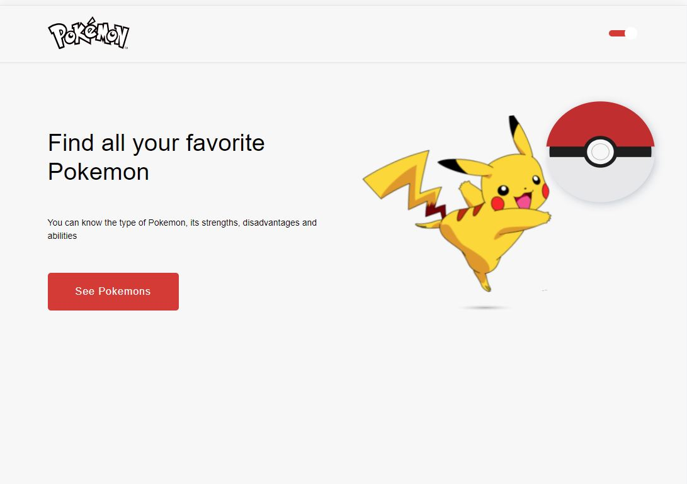

<h1 align="center">
   Pokemon
</h1>

<br>

## 🧪 Tecnologias

Esse projeto foi desenvolvido com as seguintes tecnologias:

- [React](https://reactjs.org)
- [TypeScript](https://www.typescriptlang.org/)
- [Styled Components](https://styled-components.com/)

## 🚀 Como executar

Clone o projeto e acesse a pasta do mesmo.

```bash
$ git clone https://github.com/angelicacamboim/pokemon-react
```

Para iniciá-lo, siga os passos abaixo:

# Iniciar o projeto
```bash
$ npm install
$ npm start
```
O app estará disponível no seu browser pelo endereço http://localhost:3000.


## 💻 Projeto

Listagem de pokemons utilizando a api https://pokeapi.co/ 


## 🔖 Layout


